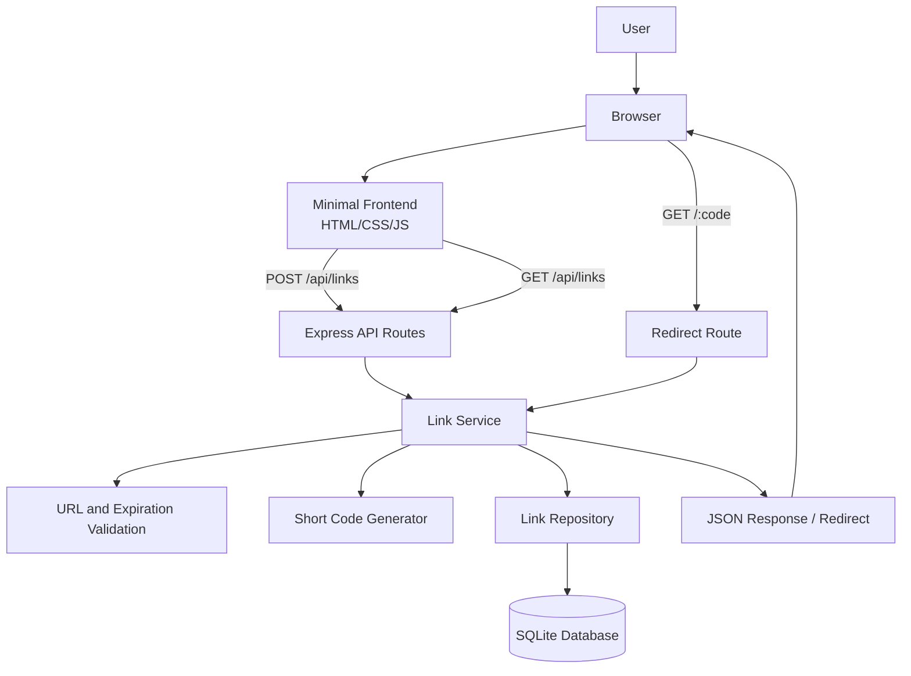

# ARCHITECTURE.md

## Overview

URL shortener нь REST API төвтэй жижиг web application байна. Frontend нь хэрэглэгчээс урт URL болон optional expiration date авч backend API руу илгээнэ. Backend нь URL validation хийж, random short code үүсгээд SQLite database-д хадгална. Хэрэглэгч short URL-аар ороход redirect endpoint short code-г хайж, хүчинтэй эсэхийг шалгаад click count нэмэгдүүлсний дараа original URL руу redirect хийнэ.

## Architecture Diagram

## Layer Description

### Frontend Layer

- Minimal HTML/CSS/JS interface.
- Long URL оруулах form харуулна.
- Expiration date сонгох боломж өгнө.
- API-аас ирсэн short URL болон basic detail мэдээллийг харуулна.

### API Layer

- Express route-уудыг агуулна.
- Request body, route parameter, response status-ийг зохицуулна.
- Гол endpoint-ууд:
  - `POST /api/links` - short URL үүсгэх
  - `GET /api/links` - үүсгэсэн links жагсаах
  - `GET /api/links/:code` - link detail авах
  - `GET /:code` - original URL руу redirect хийх

### Service Layer

- Business logic байрлана.
- URL format шалгах.
- Expiration date хүчинтэй эсэхийг шалгах.
- Random short code үүсгэх.
- Duplicate short code гарвал дахин үүсгэх.
- Redirect хийх үед expiration шалгаж click count нэмэх.

### Repository / Data Layer

- SQLite database-тэй харилцана.
- Link үүсгэх, хайх, жагсаах, click count update хийх query-г тусгаарлана.

## Data Model

| Field | Type | Description |
|---|---|---|
| `id` | integer | Primary key |
| `original_url` | text | Хэрэглэгчийн оруулсан урт URL |
| `short_code` | text | Random generated unique code |
| `click_count` | integer | Redirect хийгдсэн тоо |
| `expires_at` | datetime/null | Optional expiration date |
| `created_at` | datetime | Link үүссэн огноо |

## Data Flow

### Create short URL

1. User frontend form дээр original URL болон optional expiration date оруулна.
2. Frontend `POST /api/links` request илгээнэ.
3. API layer request-ийг service layer руу дамжуулна.
4. Service layer URL болон expiration date validation хийнэ.
5. Service layer random short code үүсгэнэ.
6. Repository layer link record-ийг SQLite database-д хадгална.
7. API short URL болон link detail-ийг JSON response болгон буцаана.

### Redirect by short code

1. User `/:code` URL руу орно.
2. Redirect route short code-г service layer руу дамжуулна.
3. Service layer database-аас link хайна.
4. Link байхгүй бол `404 Not Found` буцаана.
5. Link expired бол `410 Gone` буцаана.
6. Link хүчинтэй бол click count нэмэгдүүлнэ.
7. Browser original URL руу redirect хийнэ.

## Error Handling

- Invalid URL: `400 Bad Request`
- Missing required field: `400 Bad Request`
- Short code not found: `404 Not Found`
- Expired link: `410 Gone`
- Unexpected server error: `500 Internal Server Error`

## Security Considerations

- URL input validation хийх.
- `javascript:` зэрэг аюултай scheme зөвшөөрөхгүй.
- SQL query-г parameterized байдлаар бичих.
- Error response дээр internal stack trace харуулахгүй.
- Future build дээр rate limiting нэмэх боломжтой.
